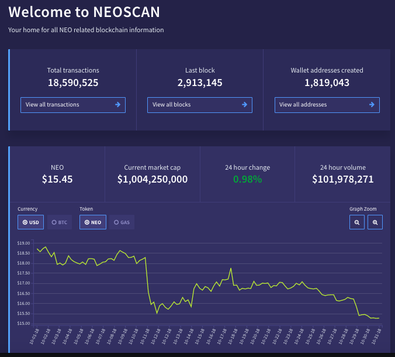

# 区块链浏览器

尽管你可以使用 RPC 命令从区块链读取信息且无需保存数据，但要获得更直观的体验，可以使用区块链浏览器。要注意的是，浏览器只是辅助工具，有些功能还是需要使用节点的 PRC 命令。

## 社区区块链浏览器
### [Neoscan](https://neoscan.io/)

**API 文档:** https://neoscan.io/docs/index.html  
**GitHub:** https://github.com/CityOfZion/neo-scan

### [NeoTracker](neotracker.io)

**GitHub:** https://github.com/neotracker/neotracker

### [Scan](https://scan.nel.group/#mainnet)

**API 文档:** http://www.xiaoyaoji.cn/share/1H0gjTDtfk/ - Chinese only  
**GitHub:** https://github.com/NewEconoLab/NELBrowser-Web

### [StateBrowser](https://state.otcgo.cn/?idx=0)

**API 文档:**
https://otcgo.github.io/doc/  
**GitHub:** https://github.com/OTCGO/state-browser

### [Antcha.in](http://antcha.in/) - 仅支持中文

更多区块链浏览器，请查看 http://ndapp.org/ 下的 Explorer 页面。